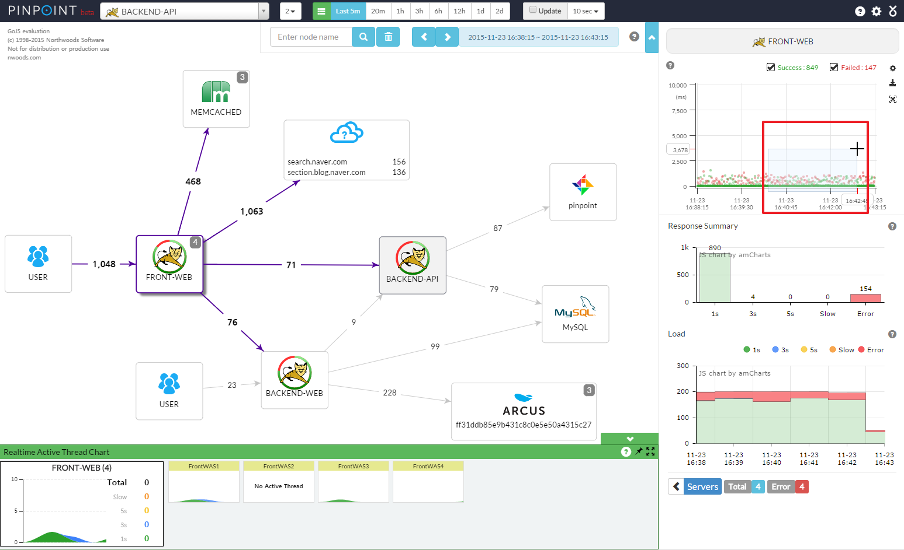
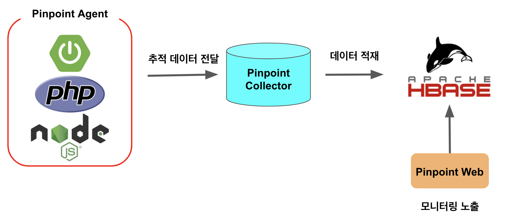
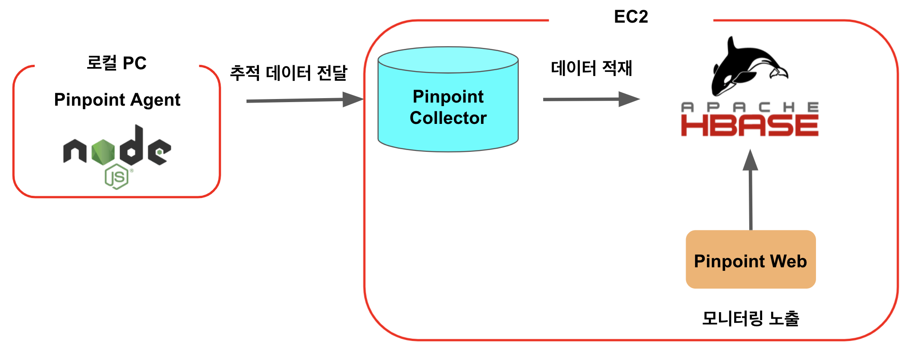
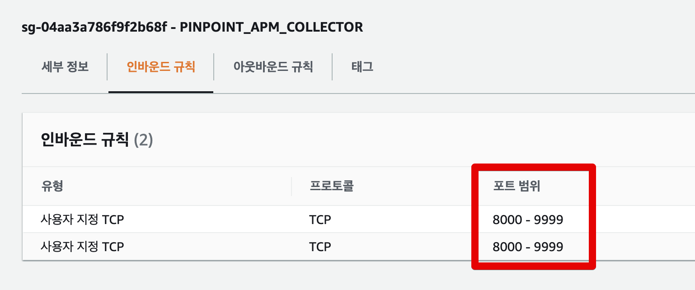
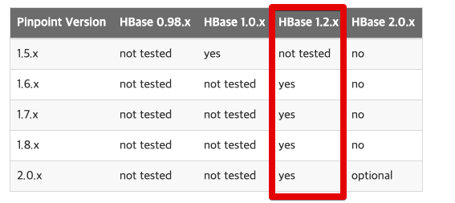
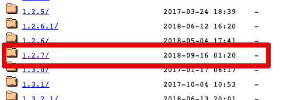
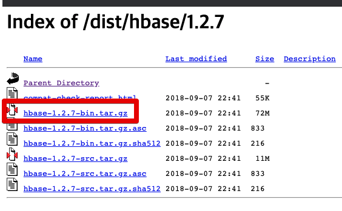
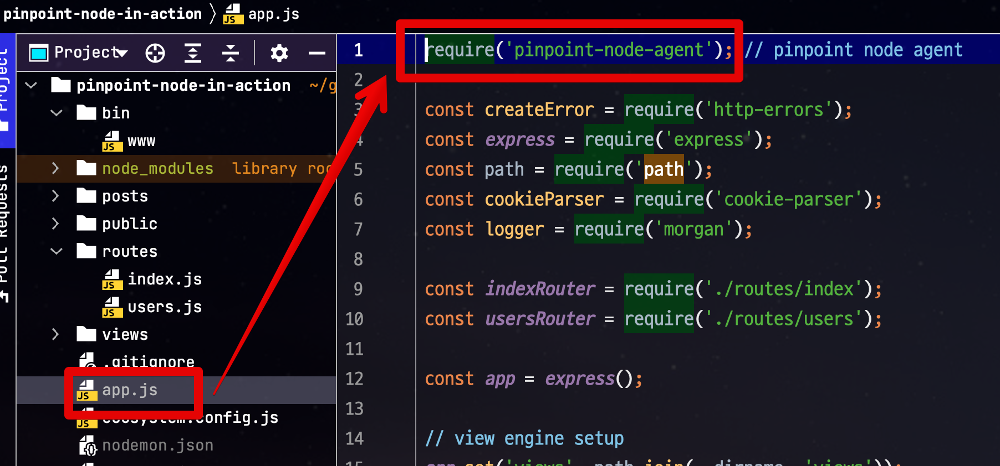
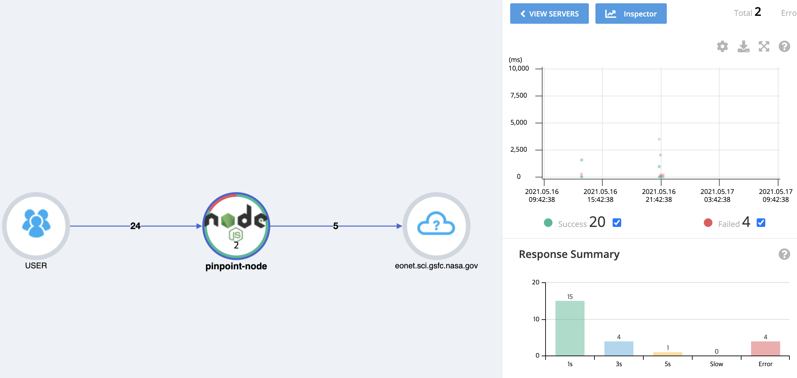
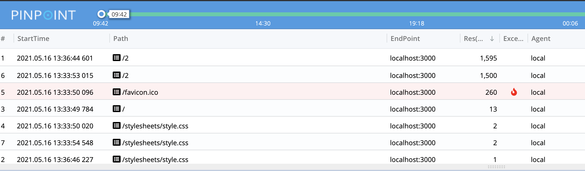

# Naver Pinpoint APM Node 버전 설치하기

자바 진영에서 유명한 **분산 환경 APM** (Application Performance Monitoring) 도구를 고르라고 하면 [네이버에서 만든 Pinpoint](https://d2.naver.com/helloworld/1194202)를 쉽게 떠올리곤 하는데요.  



특히나 요즘 같이 분산환경에서 애플리케이션 모니터링에 최적화된 기능들이 많아 백엔드 구성하는데 있어 큰 도움을 받는데요.  
  
아쉽게도 그동안 공식적으로 Java / PHP / 파이썬 / C 만 지원을 하던 중에, 드디어 [Node를 지원](https://deview.kr/2019/schedule/281)하기 시작했습니다.  
  
물론 자바처럼 100%를 지원하진 않지만, 그럼에도 충분한 장점이 있는  Pinpoint Node Agent를 이번 시간에는 설치해보겠습니다. 

> 이 모든 과정은 기존에 Pinpoint 구성이 없다고 가정해서 진행합니다.  
> 이미 Pinpoint를 구성해서 사용하는 중이시라면, 3번으로 바로 가시면 됩니다.

## 0. 구성 소개

Pinpoint에는 여러 모듈이 있지만, 이 중에서 가장 중요한 모듈은 크게 3가지 입니다.  
  
* Pinpoint Agent
  * 애플리케이션의 모니터링 정보를 Collector로 전달
* Pinpoint Collector
  * Agent에서 받은 정보를 HBase에 적재 
* Pinpoint Web
  * 적재된 데이터를 Web으로 노출하여 모니터링 제공



Pinpoint는 코드 수준의 정보를 추적하는데요.  
그러다보니 트래픽이 많으면 많을수록 데이터의 양이 폭발적으로 증가한다는 단점이 있습니다.  
그래서 Pinpont는 이 정보들을 Hbase에 담아서 활용합니다.  
  
> Hbase는 하둡 기반의 **분산 데이터베이스**로 빅데이터를 저장하기 위해서 사용됩니다.  

위에서 언급한 각 모듈들은 별도 서버에 구축해야하는데요.  
여기서는 간단하게 샘플로만 작동할 예정이니 아래와 같이 구성할 예정입니다.



* EC2에 Hbase, Collector, Web을 모두 설치
* 로컬 PC에 Agent 를 설치해서 Node 프로젝트에 구성해서 실행

자 그럼 이제 모듈들을 하나씩 설치해보겠습니다.

## 1. HBase 구성

## 1-1. EC2 구성

Hbase, Collector, Web을 모두 설치할 EC2가 하나 있어야 합니다.  
EC2를 설치하는 것은 너무 쉬운일이니 별도로 가이드는 없이 진행하겠습니다.  
다만 주의하실 것들이 있는데요.  
  
EC2의 보안 그룹 **인바운드에는 9991 ~ 9993까지는 필수**로 포함되어야 합니다.



(저는 8000~9999 까지를 인바운드에 포함시켰습니다.)  
  
이유는 Agent가 Collector로 로그 전송을 할때 사용하는 tcp 포트가 9991 ~ 9993까지가 기본값으로 되어있기 때문입니다.  
  
또한, 자바 역시 **1.8이상**이 필수로 설치되어 있어야합니다.  
(Amazon Linux2는 기본적으로는 Java가 미설치된 상태)  
  
이 2가지는 꼭 진행하셔서 EC2를 만드시면 됩니다.  
  
(Hbase에 많은 데이터가 적재될 예정이니 EC2의 기본 볼륨은 조금 높게 잡으셔도 좋습니다.)

## 1-2. Hbase 설치

현재 Hbase는 2.x까지 나와있지만, 아직까지 Pinpoint의 모든 버전은 1.2.x 버전에 최적화 되어있습니다.



그래서 여기서도 1.2.x의 최신 버전인 1.2.7 (2021.05.15 기준)을 설치하겠습니다.  
  
먼저 [Hbase 아카이브 사이트](https://archive.apache.org/dist/hbase) 로 이동하여 1.2.7 버전의 tar.gz 파일 다운로드 링크를 가져옵니다.





그리고 EC2에 접속하셔서 `wget`으로 해당 압축파일을 다운 받습니다.

```bash
wget https://archive.apache.org/dist/hbase/1.2.7/hbase-1.2.7-bin.tar.gz
```

다운 받은 압축파일을 합축 해제합니다.

```bash
tar xzf hbase-1.2.7-bin.tar.gz
```

압축해제가 끝나셨으면 (매번 hbase-1.2.7을 명령어에서 사용할 수 없으니) 해당 디렉토리에 `link`를 걸겠습니다.  

```bash
ln -s hbase-1.2.7 hbase
```

이렇게 링크를 거시면 앞으로는 `hbase` 디렉토리 이동하면 `hbase-1.2.7`로 이동하게 됩니다.  
  
이렇게 하면 설치는 끝이납니다.  
  
설치된 Hbase를 Hbase를 실행시킵니다.

```bash
hbase/bin/start-hbase.sh
```

실행완료가 되시면 Pinpoint 정보를 담을 테이블을 만들어야하는데요.  
이에 대해서는 이미 Pinpoint가 스크립트를 지원하기 때문에 해당 스크립트를 다운 받아 실행하면 됩니다.

```bash
wget https://raw.githubusercontent.com/pinpoint-apm/pinpoint/master/hbase/scripts/hbase-create.hbase
```

스크립트 다운이 다 되셨으면 바로 스크립트를 실행해서 Pinpoint 테이블을 생성합니다.

```bash
hbase/bin/hbase shell ../hbase-create.hbase
```

여기까지 하셨으면 Hbase 구성은 끝납니다.  
바로 EC2에 Collector와 Web을 설치해보겠습니다.

> 실제 운영 환경에서 대량의 데이터를 무중단으로 다루기 위해서는 클라우드에서 지원하는 Hbase 서비스로 이관하시는 것을 고려하시며 됩니다.  
> (AWS EMR 등)
 
## 2. Collector & Web 설치

Hbase가 구성된 EC2에 계속해서 설치를 진행하겠습니다.

### 2-1. Collector 설치

예전에는 Pinpoint의 모듈들이 Tomcat에서 War를 올리는 방식만을 지원했는데요.  
  
최근에는 스프링부트 기반으로 Jar 단독 실행이 지원되어서, 별도의 WAS 설치가 불필요해졌습니다.  
  
그래서 바로 `jar`파일만 다운받겠습니다.

```bash
wget https://github.com/pinpoint-apm/pinpoint/releases/download/v2.2.2/pinpoint-collector-boot-2.2.2.jar
```

해당 jar파일에 실행 권한을 줍니다.

```bash
chmod +x pinpoint-collector-boot-2.2.2.jar
```

그리고 바로 jar를 실행합니다.

```bash
nohup java -jar -Dpinpoint.zookeeper.address=localhost pinpoint-collector-boot-2.2.2.jar >/dev/null 2>&1 &
```

* `nohup ~ >/dev/null 2>&1 &`
  * `nohup.out` 로그 파일 생성 없이, 세션 종료 없이 백그라운드 실행을 위해 사용합니다.
* `-Dpinpoint.zookeeper.address=localhost`
  * 원래는 분산된 Hbase의 zookeeper 주소를 써야하지만, 여기서는 다 같은 EC2 안에 있으니 `localhost`를 사용합니다.

Collector 설치가 끝났으니 바로 Web 설치를 진행하겠습니다.

### 2-2. Web 설치

Web설치는 Collector와 거의 동일한데요.  
다운받은 Jar 파일 주소만 다를뿐이지 그 외에는 완전히 동일합니다.  

```bash
wget https://github.com/pinpoint-apm/pinpoint/releases/download/v2.2.2/pinpoint-web-boot-2.2.2.jar
```

```bash
chmod +x pinpoint-web-boot-2.2.2.jar
```

```bash
nohup java -jar -Dpinpoint.zookeeper.address=localhost pinpoint-web-boot-2.2.2.jar >/dev/null 2>&1 &
```

자 이제 Pinpoint Agent 를 제외하고 모든 것이 설치되었습니다.  

## 3. Node Agent 설치

이제 이렇게 구성된 Pinpoint 환경에 Node Agent를 연결해볼텐데요.  
  
일반적으로는 Node 프로젝트가 실행되는 EC2에서 해야겠지만, 여기서는 테스트이니 로컬 PC에서 진행하겠습니다.

### 3-1. 프로젝트에 Agent 추가

먼저 Pinpoint로 모니터링하고 싶은 프로젝트에 [pinpoint-node-agent](https://www.npmjs.com/package/pinpoint-node-agent)를 설치합니다.


> 모든 코드는 [Github](https://github.com/jojoldu/pinpoint-node-in-action)에 있습니다.

```bash
npm install --save pinpoint-node-agent 
```

```bash
yarn add pinpoint-node-agent
```

패키지가 설치되셨으면 **애플리케이션 entiry 지점 최상단**에 패키지를 `import` 혹은 `require` 시킵니다.



ES6

```javascript
import 'pinpoint-node-agent'  
```

CommonJS

```javascript
require('pinpoint-node-agent')
```

이렇게 하면 이제 이 프로젝트에서는 Pinpoint Node Agent를 실행시킬 수 있는 환경이 되었습니다.

### 3-2. 프로젝트 실행

Pinpoint Node Agent를 실행시키기 위해서는 3가지 설정이 필수인데요.  

* `PINPOINT_APPLICATION_NAME`
  * Pinpoint에 연결된 많은 프로젝트들 중, 이 프로젝트를 구분짓기 위한 ID
  * 스케일아웃하여 여러 EC2로 구성되어있더라도 같은 프로젝트라면 이 값을 모두 같은 값으로 둔다.
* `PINPOINT_AGENT_ID`
  * 같은 `PINPOINT_APPLICATION_NAME` 내에서 각 서버들을 구분하기 위한 ID
  * 보통은 서버 IP를 지정합니다.
* `PINPOINT_COLLECTOR_IP`

이 3개 값은 필수라서 환경변수 (Environment Variable)로 꼭 지정해야 합니다.  
  
그리고 이 외에 필수는 아니지만, **이번 시간에는 필수**로 지정되야 할 값이 바로 `PINPOINT_SAMPLING_RATE` 입니다.

* `PINPOINT_SAMPLING_RATE`
  * 대량의 트래픽을 모두 추적할 것인지, 그 중 일부만 샘플링해서 추적할 것인지 판단합니다. (네이버의 몇몇 서비스들은 하루에 20억건 요청이 오다보니 이를 다 추적하는것은 비용낭비가 심하여 10% 이내만 샘플링해서 본다고 합니다.)
  * 샘플링 %는 (1/`PINPOINT_SAMPLING_RATE`) 공식으로 진행됩니다.
  * 즉, `PINPOINT_SAMPLING_RATE`의 값을 10으로 하게 되면 1/10이 되어 10%만 샘플링, `PINPOINT_SAMPLING_RATE`를 1로 두게되면 1/1이 되어 100% 추적이 됩니다.

이 값은 기본값이 10인데, 이렇게 될 경우 10%만 샘플링하게 되니, 테스트에서는 100% 추적하기 위해 1로 변경합니다.  
  
이렇게 4가지의 환경 변수를 로컬 실행시에 적용해야하니 각자 실행 환경에 맞게 환경 변수에 넣어주시면 됩니다.  
  
저는 로컬 개발을 위해 [nodemon](https://www.npmjs.com/package/nodemon)을 사용하고 있어, `nodemon.json`에 해당 변수들을 넣어서 사용하겠습니다.

```javascript
{
  "env": {
    "PINPOINT_COLLECTOR_IP":"ec2 ip",
    "PINPOINT_SAMPLING_RATE":"1",
    "PINPOINT_APPLICATION_NAME":"pinpoint-node",
    "PINPOINT_AGENT_ID": "local"
  }
}
```

이렇게 구성이 되셨다면 한번 프로젝트를 실행해봅니다.  
  
실행된 프로젝트에서 몇가지 API와 페이지들을 호출해보신 뒤, Pinpoint Web 서버로 브라우저 접속을 해보시면 아래와 같이 핀포인트에 요청들이 노출되는 것을 볼 수 있습니다.



우측 그래프의 점들을 드래그 해서 확인해보시면 각 요청들이 트레이스 되는 것도 보실 수 있습니다.



다음 시간에는 이렇게 구성된 Pinpoint Node 환경에서 기본 사용법과 여러 설정들과 기능들을 사용해보겠습니다.


