# Pinpoint APM Node 사용하기

[지난 시간](https://jojoldu.tistory.com/573)에 이어, 설치된 Pinpoint Node 의 기본적인 사용법과 장단점을 배워보겠습니다.  

## 1. 로컬 프로젝트에서 접근하기

저는 로컬 개발을 위해 [nodemon](https://www.npmjs.com/package/nodemon)을 사용하고 있어, `nodemon.json`에 다음과 같이 설정을 해서 접근할 수 있습니다.

```javascript
{
  "env": {
    "PINPOINT_COLLECTOR_IP":"ec2 ip",
    "PINPOINT_SAMPLING_RATE":"1",
    "PINPOINT_APPLICATION_NAME":"pinpoint-node",
    "PINPOINT_AGENT_ID": "local"
  }
}
```

> 물론 Pinpoint Collector의 방화벽 (Security Group) 에 현재 로컬 PC의 IP가 **인바운드에 등록** (포트: 9991 ~ 9993) 되어 있어야 합니다.

위 옵션들에 대해서는 이미 [기존 포스팅](https://jojoldu.tistory.com/573)에서 언급되어있으니 참고하시면 됩니다.  
  
꼭 nodemon이 아니더라도 각종 실행 환경에서 환경 변수 (Environment Variable)로 위 값들을 설정하시면 됩니다.

## 2. 대시보드 기능

그럼 이제 Pinpoint 모니터링의 여러 기능들을 하나씩 알아보겠습니다.

### 2-1. 대시보드 소개

Pinpoint Web의 대시보드는 다음과 같이 구성 됩니다.

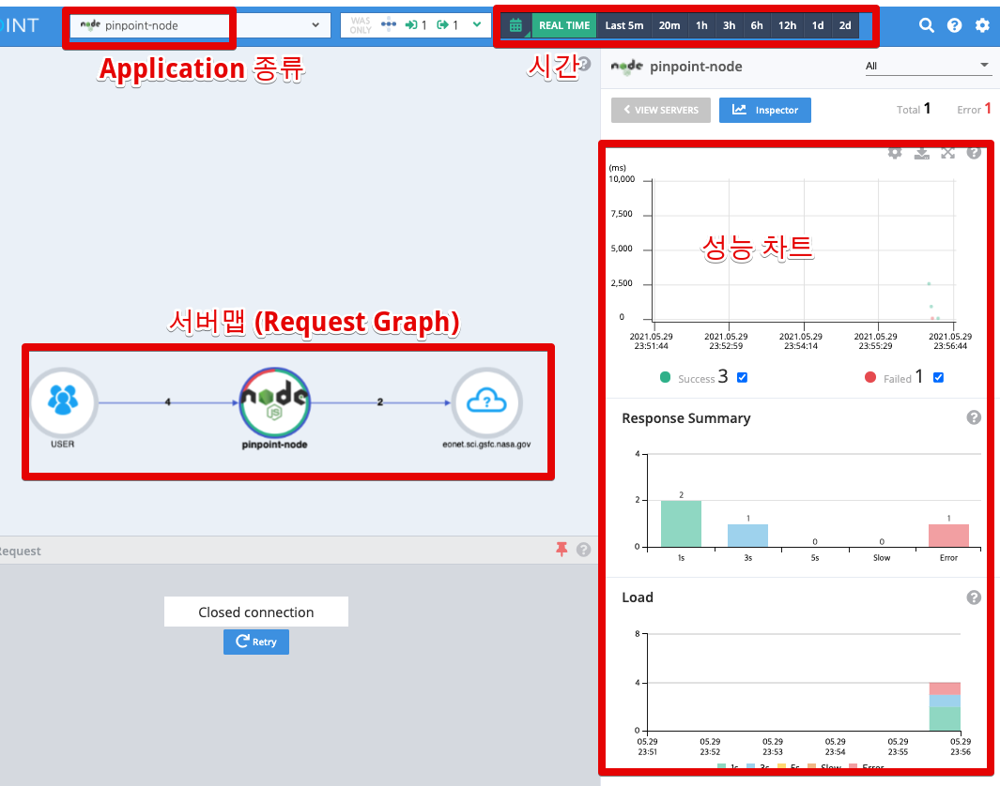

여기서 Application 종류와 시간은 사용하시는데 큰 불편이 없을것 같아서, 그 외 나머지 다른 기능들에 대해서 소개드리겠습니다.

#### 서버맵

분산환경을 한 눈에 볼 수 있는 서버맵입니다.  

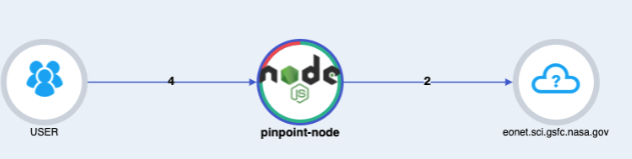

화면상에서 구름(+물음표)로 구성된 아이콘은 **핀포인트가 인식하지 못하는 서비스**를 나타냅니다.  
여기서는 `https://eonet.sci.gsfc.nasa.gov` 는 핀포인트 연동도, MySQL과 같은 데이터 스토어도 아니기 때문에 구름으로 표기됩니다.  
  
이미지속에서는 간단하게 요청자 -> 애플리케이션 -> 외부 API 서버로 구성된 모습만 보이는데요.  
좀 더 여러 서비스들이 연결 되어있다면 다음과 같은 형태로 구성되게 됩니다.

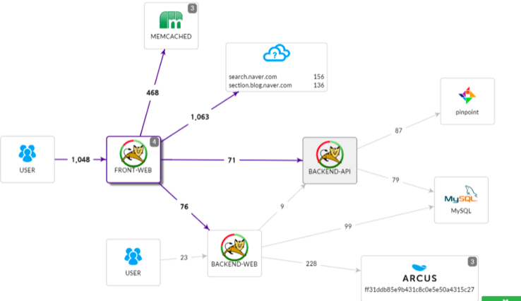

> 물론 현재 Pinpoint Node는 MySQL / Redis / MongoDB 를 지원하지만 PostgreSQL에 대해서는 지원하지 않아 디테일하게 나오진 않습니다.

각 지점마다의 화살표와 숫자들은 실제 서비스간 요청수를 나타내기 때문에 **기간동안 얼마나 많은 요청이 온건지**도 알 수 있습니다.

#### 성능 차트

사용자를 통해 들어온 Request에 대해서 성공/실패수, 응답시간 등의 지표를 그래프화 해서 보여줍니다.  

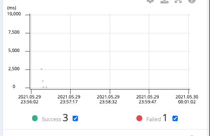
  
현재는 요청수가 적어서 드라마틱하게 보이지 않으시겠지만, 실제 서비스 환경에서는 다음처럼 요청이 실시간으로 밀리고 있음을 볼 수 있습니다.

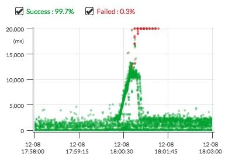

(출처: [우아한형제들 기술 블로그-빌링 시스템 장애, 이러지 말란 Maria~](https://woowabros.github.io/experience/2017/01/20/billing-event.html))

여기서 특정 요청건에 대해서 자세히 Callstack를 보고싶으시면 다음과 같이 드래그를 하시면 됩니다.

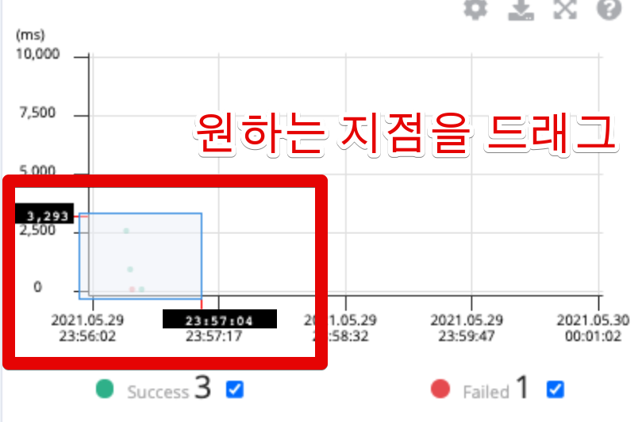

#### 콜스택 (Callstack)

위에서 소개한대로 드래그를 하게 되면 아래와 같이 콜스택이 보이게 됩니다.

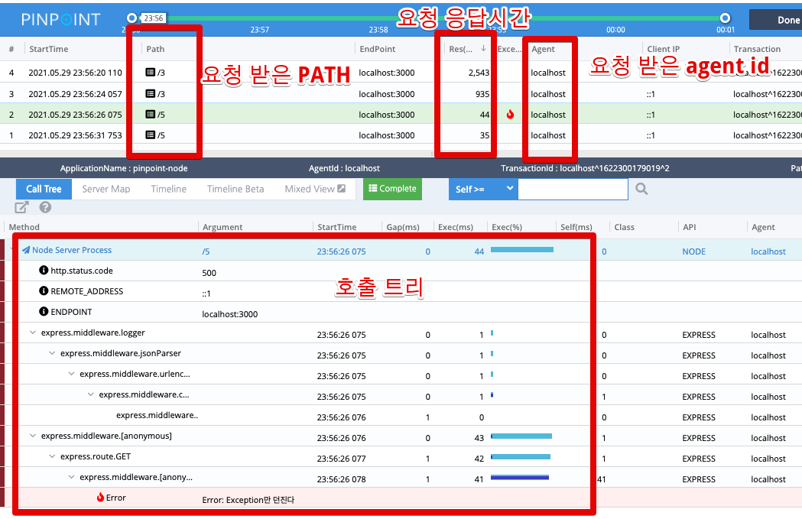

콜스택에서는 콜스택별로 얼마나 시간이 소요되었는지, 어떤 Exception이 발생했는지까지 노출 됩니다.

> 아직까지는 function 단위로 trace가 되지 않지만, 다음 버전에서는 해당 기능 역시 추가된다고 합니다.

#### http param

JVM 의 핀포인트를 써보신 분들은 이게 무슨 기능인가 싶으실텐데요.  
2021.05.27 까지 Pinpoint node (0.8.2) 에서는 **http param 기능을 지원하지 않습니다**.  

* [http params (query string) not visible](https://github.com/pinpoint-apm/pinpoint-node-agent/issues/85)
  
아래와 같이 **요청한 Request Param을 보고 싶다면** Pinpoint Node Agent 버전을 `0.9.0-next.0` 이상은 구성해야만 합니다.

```javascript
"pinpoint-node-agent": "0.9.0-next.0"
```

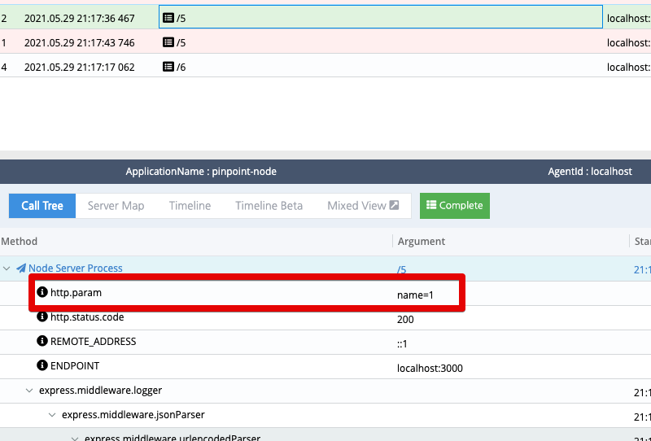

### 2-2. 트랜잭션 필터

만약 핀포인트상에서 **특정 URL PATH만 검색**하고 싶으실때는 트랜잭션 필터를 사용하면 됩니다.
  
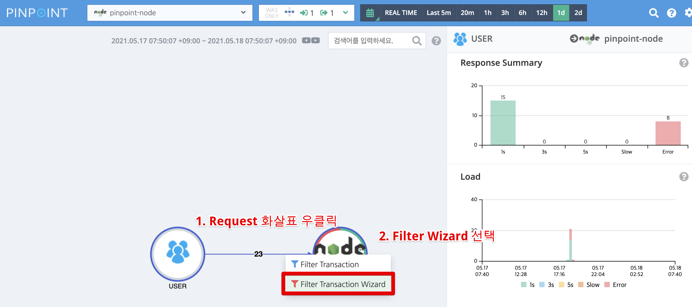

Filter Trasnaction Wizard 화면으로 이동하게 되면 다음과 같이 URL Path를 필터링 할 수 있는 화면이 나옵니다.

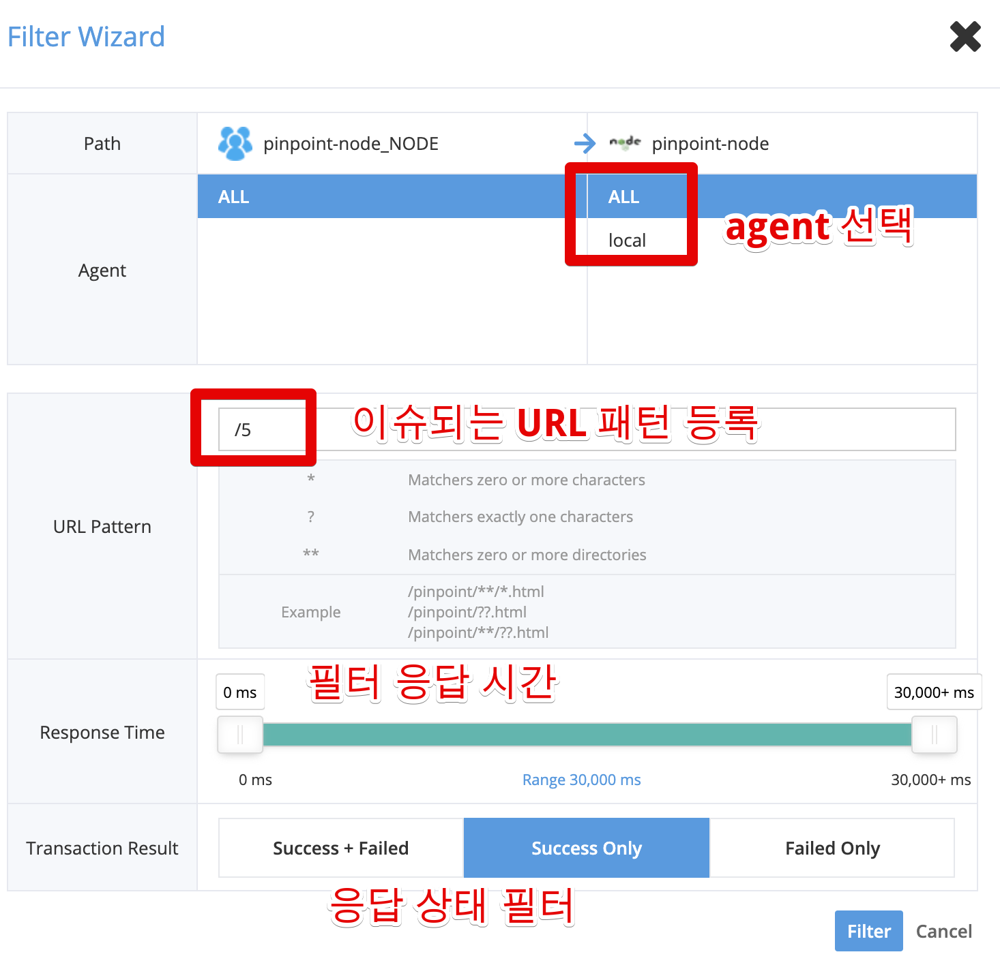

이렇게 하시면 화면상에서는 지정된 URL만 대시보드에 나오게 됩니다.

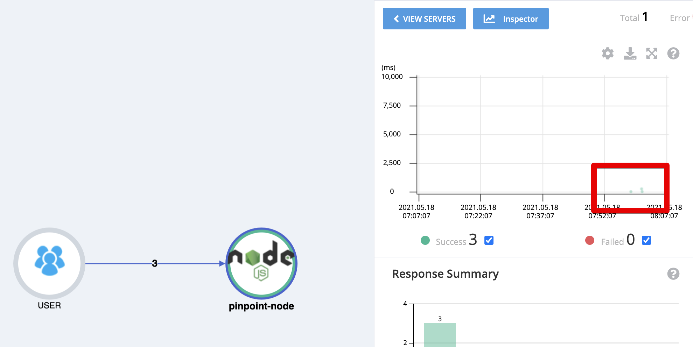

여기서 드래그를 해서 Callstack을 비교하시면 됩니다.

### 2-3. 불필요한 Trace 대상 제거

Pinpoint는 지정된 Application Server의 모든 요청에 대한 모니터링이 되기 때문에 **굳이 필요하지 않은 요청까지도 대상**에 포함되기도 하는데요.  
이를테면 CSS, JS, favicon 등의 요청등은 굳이 모니터링하지 않아도 되기 때문에 이런 요청들은 다음과 같이 환경 변수에 넣어서 제외할 수 있습니다.

> 보통 이런 정적 파일 (static resources) CloudFront 혹은 Load Balancer 등에서 모니터링합니다.

```javascript
{
  "env": {
    ...
    "PINPOINT_TRACE_EXCLUSION_URL_PATTERN": "/stylesheets/*,/css/*,/favicon.ico",
    ...
  }
}
```

## 3. 개인적인 의견

다음은 Pinpoint Node를 써보면서 느낀 개인적인 의견입니다.  
도입을 고민하신다면 한번 참고해보셔도 좋을것 같습니다.

### 3-1. 장점

애초에 Pinpoint 자체가 **모든 APM을 대체하겠다** 보다는 메인 APM을 두고 (Newrelic, Datadog, ELK) 서브 모니터링 도구로 사용하는 것에 최적화 되어있습니다.  
이런 점에 있어서 큰 장점들은 다음과 같습니다.

* 모든 APM 중에 가장 이슈 대응에 최적화된 대시보드와 Callstack
  * 실시간으로 API 요청이 밀리고 있거나 / 오류가 나고 있음을 모니터링 도구에 대한 이해가 없는 사람이라도 한 눈에 알 수 있습니다.
* 별도의 로그를 남기지 않고도 모니터링이 가능
  * 운영 환경, 장애대응 경험이 없어 로그를 잘 남기지 못한 회사라면 특히나 도움됩니다.
* Slow URL에 대한 빠른 디텍팅
* Redis, MongoDB, MySQL 지원

### 3-2. 단점

위 장점들에 비해 단점들은 다음과 같습니다.

* JVM 계열의 여러 기능들 중 일부만 지원
  * 대시보드의 Inspector를 비롯해서 일부 기능들이 아직까지는 지원되지 않음
* **function 단위 Callstack**이 노출되지 않는다
  * 여러 function들이 실행될때 어느 function 에서 처리가 오래 걸렸는지, 에러가 발생했는지 추적이 안되고 있음.
  * 이는 [0.9.0 버전에 도입](https://github.com/pinpoint-apm/pinpoint-node-agent/issues/2)된다고 합니다.
* PostgreSQL 등 **MySQL을 제외한 RDBMS 지원이 안됨**.
* Redis, MongoDB는 일부 패키지만 지원한다.
  * Redis는 ioredis만, MongoDB는 mongodb-core만 지원.
  * mongoose 등은 지원하지 않음.
* Express에서 직접 statusCode를 5xx로 변경하면 failed로 판단하지 않는다.
  * **Exception 발생했을때만 Fail로 판단**

### 3-3. 적용 후기

Pinpoint Node 는 [프론트 서버](https://www.youtube.com/watch?v=38cmd_fYwQk)(웹 프론트가 아니라, 서비스 제일 앞단에서 트래픽을 받아주고 다른 도메인 서비스 API들을 Aggregate 하는 역할) 서비스에 중점을 맞춘 APM이라고 판단됩니다.  
  
특히 이 생각을 하게 된 이유는 이 Node Agent를 만든 네이버 쇼핑 역시 자바&스프링으로 백엔드 API를 만들고, 백엔드 API를 Node Server에서 호출하는 구조로 사용하고 있습니다.  
(Node Server가 서버 렌더링 + API Aggregate 역할)

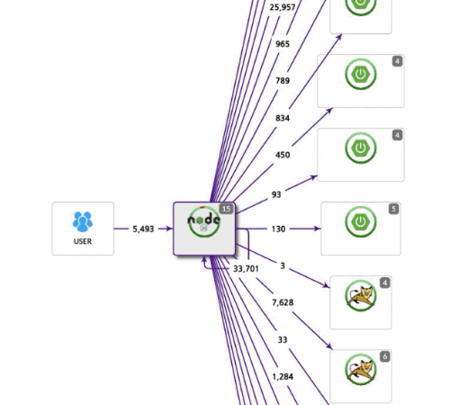

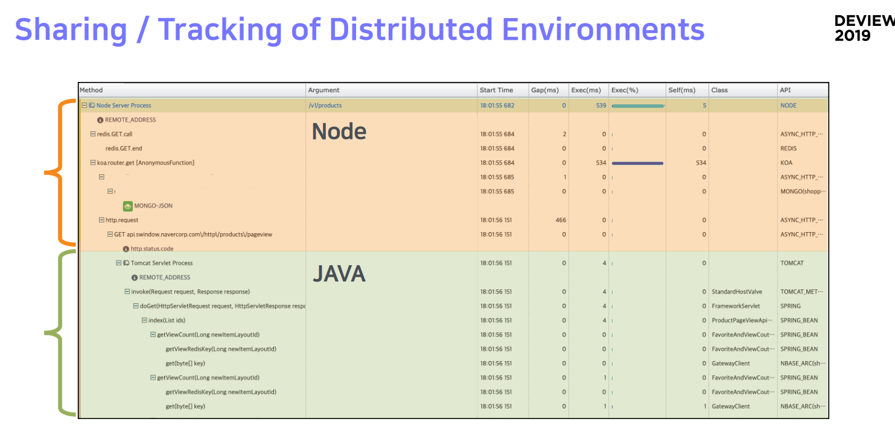

> 핀포인트는 같은 Collector Server로 요청을 보내면 agent들간의 처리내역을 이어서 볼 수 있습니다.

그러면 이런 단점때문에 쓰는게 별로인가? 라고 한다면 그렇진 않습니다.  
Newrelic, Datadog에서 부족한 점을 분명히 채워주기 때문인데요.  
같이 조합해서 써보는 것을 추천합니다.