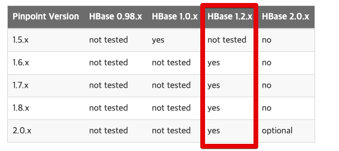
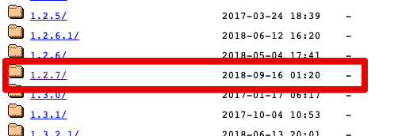
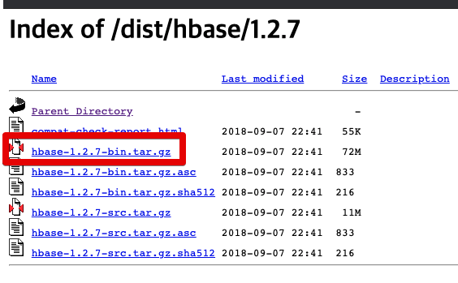

# Naver Pinpoint APM Node 버전 설치하기


## HBase 설치

[hbase 아카이브](https://archive.apache.org/dist/hbase)







```bash
wget https://archive.apache.org/dist/hbase/1.2.7/hbase-1.2.7-bin.tar.gz
```

```bash
tar xzf hbase-1.2.7-bin.tar.gz
```


```bash
ln -s hbase-1.2.7 hbase
```


```bash
cd hbase
```

```bash
hbase/bin/start-hbase.sh
```

```bash
wget https://raw.githubusercontent.com/pinpoint-apm/pinpoint/master/hbase/scripts/hbase-create.hbase
```

```bash
hbase/bin/hbase shell ../hbase-create.hbase
```

## Collector & Web 설치

```bash
wget https://github.com/pinpoint-apm/pinpoint/releases/download/v2.2.2/pinpoint-collector-boot-2.2.2.jar
```

```bash
chmod +x pinpoint-collector-boot-2.2.2.jar
```

```bash
nohup java -jar -Dpinpoint.zookeeper.address=localhost pinpoint-collector-boot-2.2.2.jar >/dev/null 2>&1 &
```

```bash
wget https://github.com/pinpoint-apm/pinpoint/releases/download/v2.2.2/pinpoint-web-boot-2.2.2.jar
```

```bash
chmod +x pinpoint-web-boot-2.2.2.jar
```

```bash
nohup java -jar -Dpinpoint.zookeeper.address=localhost pinpoint-web-boot-2.2.2.jar >/dev/null 2>&1 &
```

## Node-Agenet 설치

```bash
npm install --save pinpoint-node-agent 
```

```bash
yarn add pinpoint-node-agent
```

