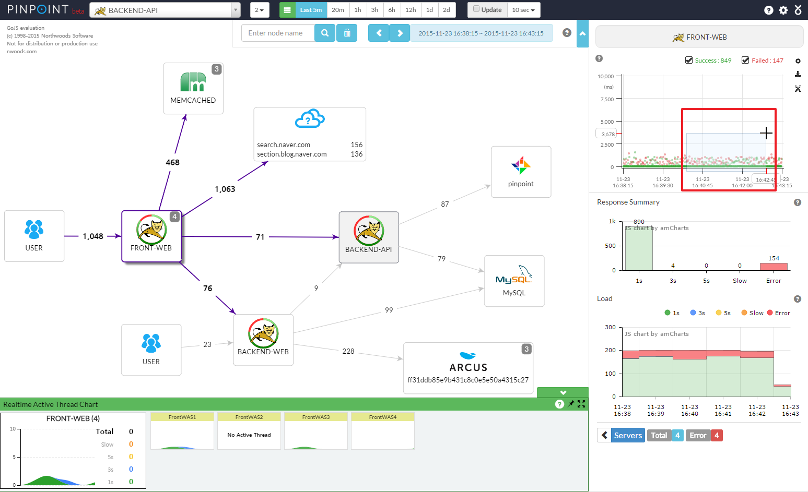
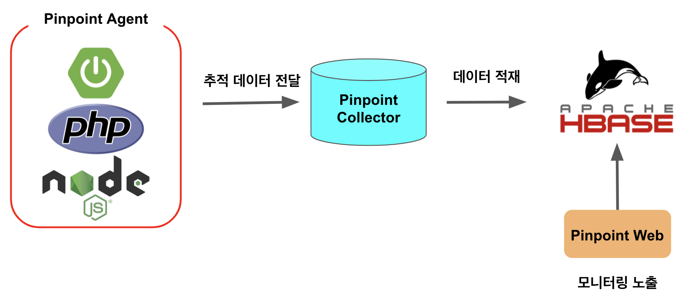
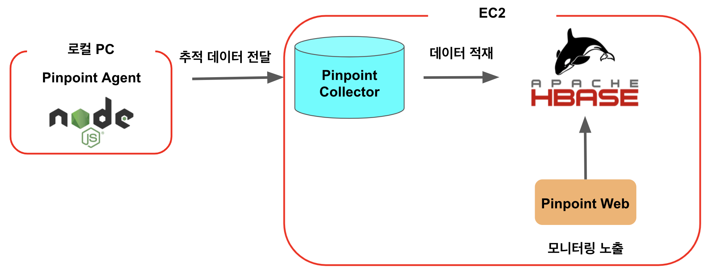
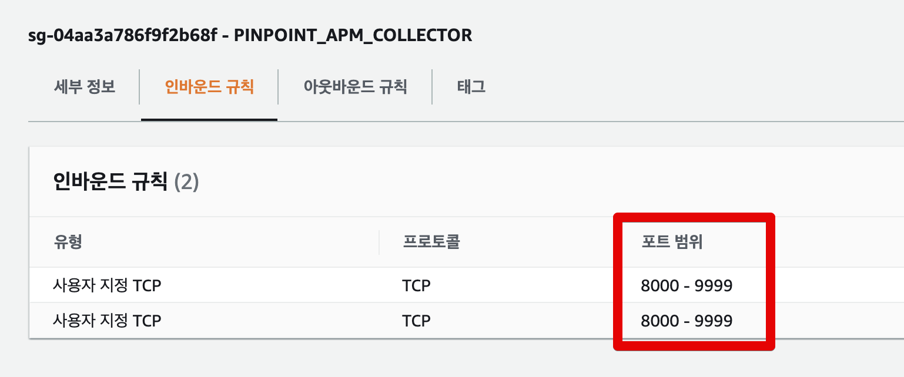
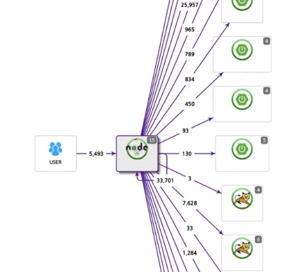
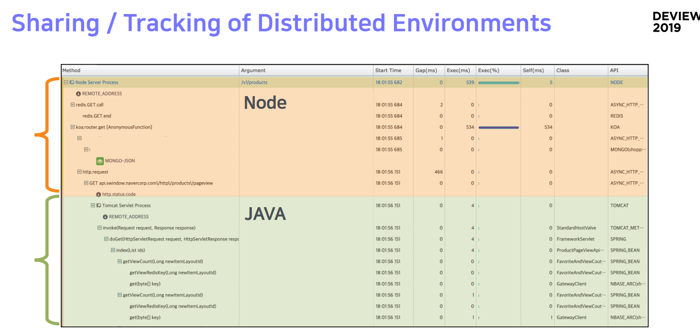

# Naver Pinpoint APM Node 버전 설치하기

자바 진영에서 유명한 **분산 환경 APM** (Application Performance Monitoring) 도구를 고르라고 하면 [네이버에서 만든 Pinpoint](https://d2.naver.com/helloworld/1194202)를 쉽게 떠올리곤 하는데요.  



특히나 요즘 같이 분산환경에서 애플리케이션 모니터링에 최적화된 기능들이 많아 백엔드 구성하는데 있어 큰 도움을 받는데요.  
  
아쉽게도 그동안 공식적으로 Java / PHP / 파이썬 / C 만 지원을 하던 중에, 드디어 [Node를 지원](https://deview.kr/2019/schedule/281)하기 시작했습니다.  
  
물론 자바처럼 100%를 지원하진 않지만, 그럼에도 충분한 장점이 있는  Pinpoint Node Agent를 이번 시간에는 설치해보겠습니다. 

> 이 모든 과정은 기존에 Pinpoint 구성이 없다고 가정해서 진행합니다.  
> 이미 Pinpoint를 구성해서 사용하는 중이시라면, 3번으로 바로 가시면 됩니다.

## 0. 구성 소개

Pinpoint에는 여러 모듈이 있지만, 이 중에서 가장 중요한 모듈은 크게 3가지 입니다.  
  
* Pinpoint Agent
  * 애플리케이션의 모니터링 정보를 Collector로 전달
* Pinpoint Collector
  * Agent에서 받은 정보를 HBase에 적재 
* Pinpoint Web
  * 적재된 데이터를 Web으로 노출하여 모니터링 제공



Pinpoint는 코드 수준의 정보를 추적하는데요.  
그러다보니 트래픽이 많으면 많을수록 데이터의 양이 폭발적으로 증가한다는 단점이 있습니다.  
그래서 Pinpont는 이 정보들을 Hbase에 담아서 활용합니다.  
  
> Hbase는 하둡 기반의 **분산 데이터베이스**로 빅데이터를 저장하기 위해서 사용됩니다.  

위에서 언급한 각 모듈들은 별도 서버에 구축해야하는데요.  
여기서는 간단하게 샘플로만 작동할 예정이니 아래와 같이 구성할 예정입니다.



* EC2에 Hbase, Collector, Web을 모두 설치
* 로컬 PC에 Agent 를 설치해서 Node 프로젝트에 구성해서 실행

자 그럼 이제 모듈들을 하나씩 설치해보겠습니다.

## 1. HBase 구성

## 1-1. EC2 구성

Hbase, Collector, Web을 모두 설치할 EC2가 하나 있어야 합니다.  
EC2를 설치하는 것은 너무 쉬운일이니 별도로 가이드는 없이 진행하겠습니다.  
다만 주의하실 것들이 있는데요.  
  
EC2의 보안 그룹 **인바운드에는 9991 ~ 9993까지는 필수**로 포함되어야 합니다.



(저는 8000~9999 까지를 인바운드에 포함시켰습니다.)  
  
이유는 Agent가 Collector로 로그 전송을 할때 사용하는 tcp 포트가 9991 ~ 9993까지가 기본값으로 되어있기 때문입니다.  
  
또한, 자바 역시 **1.8이상**이 필수로 설치되어 있어야합니다.  
(Amazon Linux2는 기본적으로는 Java가 미설치된 상태)  
  
이 2가지는 꼭 진행하셔서 EC2를 만드시면 됩니다.  
  
(Hbase에 많은 데이터가 적재될 예정이니 EC2의 기본 볼륨은 조금 높게 잡으셔도 좋습니다.)

## 1-2. Hbase 설치

현재 Hbase는 2.x까지 나와있지만, 아직까지 Pinpoint의 모든 버전은 1.2.x 버전에 최적화 되어있습니다.


그래서 여기서도 1.2.x의 최신 버전인 1.2.7 (2021.05.15 기준)을 설치하겠습니다.  
  
먼저 [Hbase 아카이브 사이트](https://archive.apache.org/dist/hbase) 로 이동하여 1.2.7 버전의 tar.gz 파일 다운로드 링크를 가져옵니다.


그리고 EC2에 접속하셔서 `wget`으로 해당 압축파일을 다운 받습니다.

```bash
wget https://archive.apache.org/dist/hbase/1.2.7/hbase-1.2.7-bin.tar.gz
```

다운 받은 압축파일을 합축 해제합니다.

```bash
tar xzf hbase-1.2.7-bin.tar.gz
```

압축해제가 끝나셨으면 (매번 hbase-1.2.7을 명령어에서 사용할 수 없으니) 해당 디렉토리에 `link`를 걸겠습니다.  

```bash
ln -s hbase-1.2.7 hbase
```

이렇게 링크를 거시면 앞으로는 `hbase` 디렉토리 이동하면 `hbase-1.2.7`로 이동하게 됩니다.  
  
이렇게 하면 설치는 끝이납니다.  
  
설치된 Hbase를 Hbase를 실행시킵니다.

```bash
hbase/bin/start-hbase.sh
```

실행완료가 되시면 Pinpoint 정보를 담을 테이블을 만들어야하는데요.  
이에 대해서는 이미 Pinpoint가 스크립트를 지원하기 때문에 해당 스크립트를 다운 받아 실행하면 됩니다.

```bash
wget https://raw.githubusercontent.com/pinpoint-apm/pinpoint/master/hbase/scripts/hbase-create.hbase
```

스크립트 다운이 다 되셨으면 바로 스크립트를 실행해서 Pinpoint 테이블을 생성합니다.

```bash
hbase/bin/hbase shell ../hbase-create.hbase
```

여기까지 하셨으면 Hbase 구성은 끝납니다.  
바로 EC2에 Collector와 Web을 설치해보겠습니다.

> 실제 운영 환경에서 대량의 데이터를 무중단으로 다루기 위해서는 클라우드에서 지원하는 Hbase 서비스로 이관하시는 것을 고려하시며 됩니다.  
> (AWS EMR 등)
 
## 2. Collector & Web 설치

Hbase가 구성된 EC2에 계속해서 설치를 진행하겠습니다.

### 2-1. Collector 설치

예전에는 Pinpoint의 모듈들이 Tomcat에서 War를 올리는 방식만을 지원했는데요.  
  
최근에는 스프링부트 기반으로 Jar 단독 실행이 지원되어서, 별도의 WAS 설치가 불필요해졌습니다.  
  
그래서 바로 `jar`파일만 다운받겠습니다.

```bash
wget https://github.com/pinpoint-apm/pinpoint/releases/download/v2.2.2/pinpoint-collector-boot-2.2.2.jar
```

해당 jar파일에 실행 권한을 줍니다.

```bash
chmod +x pinpoint-collector-boot-2.2.2.jar
```

```bash
nohup java -jar -Dpinpoint.zookeeper.address=localhost pinpoint-collector-boot-2.2.2.jar >/dev/null 2>&1 &
```

* `nohup ~ >/dev/null 2>&1 &`
  * `nohup.out` 로그 파일 생성 없이, 세션 종료 없이 백그라운드 실행을 위해 사용합니다.
 
```bash
wget https://github.com/pinpoint-apm/pinpoint/releases/download/v2.2.2/pinpoint-web-boot-2.2.2.jar
```

```bash
chmod +x pinpoint-web-boot-2.2.2.jar
```

```bash
nohup java -jar -Dpinpoint.zookeeper.address=localhost pinpoint-web-boot-2.2.2.jar >/dev/null 2>&1 &
```

## 3. Node-Agenet 설치

```bash
npm install --save pinpoint-node-agent 
```

```bash
yarn add pinpoint-node-agent
```

## 사용법

### 불필요한 Trace 대상 제거

## 장/단점 및 개인적인 생각

장점

* 모든 APM 중에 가장 디텍팅에 최적화된 UX
* 핀포인트 특유의 장점
  * 별도의 로그를 남기지 않다고 모니터링이 가능
* Slow URL에 대한 빠른 디텍팅 가능
* Redis / MongoDB 


단점

* JVM 계열의 여러 기능들 중 일부만 지원한다.
* function 단위 Trace 지원이 안된다.
  * 즉, 여러 function들이 실행될때 어느 function 중에서 처리가 오래 걸렸는지 추적이 안된다.
* PostgreSQL , MySQL 등 RDBMS 지원이 안된다.
* Express에서 직접 statusCode를 5xx로 변경하면 failed로 판단하지 않는다

핀포인트 노드는 완전히 앞단 (흔히 말하는 [프론트 서버](https://www.youtube.com/watch?v=38cmd_fYwQk): 웹프론트가 아니라, 서비스 제일 앞단에서 트래픽을 받아주고 적절하게 다른 API들을 호출하는 역할) 서비스에 중점을 맞춘 APM이라고 판단하게 되었습니다.  
  
실제로 이 Node Agent를 만든 네이버 쇼핑 역시 자바&스프링으로 백엔드 API를 만들고, 이 API를 Node Server에서 호출하는 구조로 사용하고 있습니다.  
(Node Server가 서버렌더링 / API Aggregate 역할)





> 핀포인트는 같은 Collector Server로 요청을 보내면 agent들간의 처리내역을 이어서 볼 수 있습니다.

